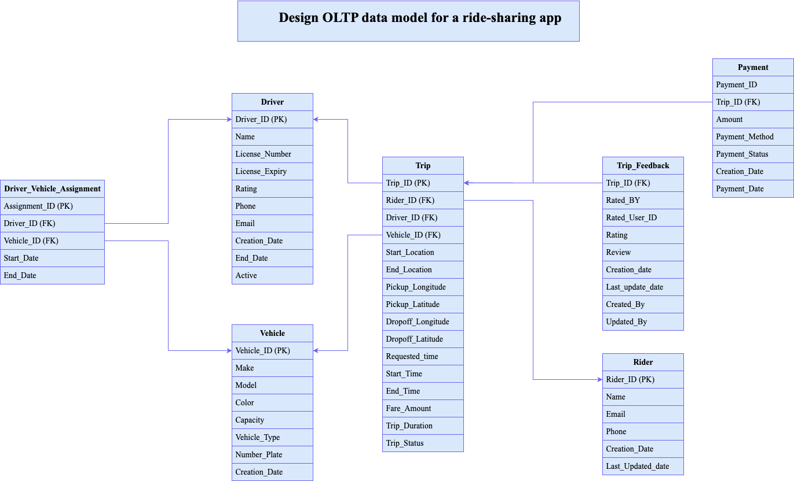

# 🚗 Uber Ride Sharing - OLTP Data Model

This folder contains the **OLTP (Online Transaction Processing)** data model for an Uber-like ride-sharing application. The database schema is designed to efficiently manage transactional operations including ride booking, driver and vehicle management, payment handling, and user feedback.

---


---

## 🧱 Purpose

The primary goal of this project is to design and implement a normalized and scalable **OLTP relational database model** for a ride-sharing service similar to Uber, optimized for data integrity, transactional accuracy, and real-time operations.

---

## 📋 Tables Created

The SQL script creates the following tables:

1. **Driver** – Stores information about drivers, license details, contact info, and ratings.
2. **Rider** – Stores rider details, including contact info and timestamps.
3. **Vehicle** – Information about vehicles used in the platform.
4. **Trip** – Main transactional table logging trip details.
5. **Driver_Vehicle_Assignment** – Tracks which drivers are assigned to which vehicles over time.
6. **Payment** – Payment transactions for completed trips.
7. **Trip_Feedback** – Feedback and rating system for both drivers and riders.

---

## 🧭 Entity Relationship Diagram

Below is the ER diagram representing the OLTP schema for the ride-sharing system:




---

## 🛠️ How to Use

1. Clone the repository:
   ```bash
   git clone https://github.com/your-username/Data-Modeling.git
   cd Data-Modeling/Uber-Ride-Share/OLTP
